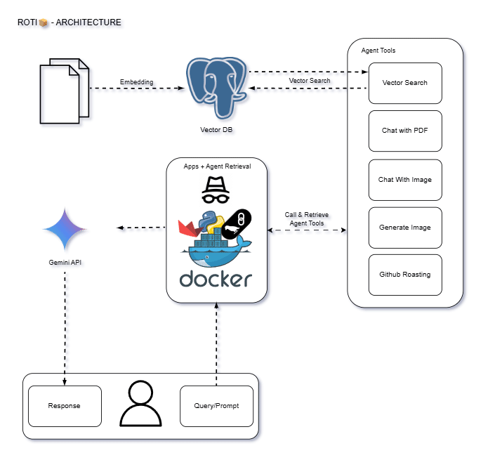

# Gemini Chatbot with Langchain, Streamlit & pgvector

This is a Streamlit-based chatbot application powered by Google Gemini and vector similarity search using `pgvector`. It supports file interactions, document embedding, and dynamic response generation with adjustable parameters (e.g., temperature, top-k, similarity thresholds).


---

## 🛠️ Setup Instructions

### 1. Install Requirements

Make sure Python 3.9+ is installed, then run:

```bash
pip install -r requirements.txt
```

### 2. Install pgvector for PostgreSQL
To enable vector similarity search, install the pgvector extension in your PostgreSQL database:
```sql
CREATE EXTENSION IF NOT EXISTS vector;
```
Or follow the full guide here: https://github.com/pgvector/pgvector

---

## 📁 Project Structure
```graphql
├── .streamlit/
│   └── config.toml                     # Streamlit config (useful for NGINX deployment)
│
├── app/
│   ├── chatbot.py                      # Core logic for Gemini agent, prompt setup, features
│   ├── utils.py                        # DB connection and pgvector similarity search
│   ├── sec_key.json                    # (If used) secret keys (add to .gitignore)
│
│
├── pages/
│   ├── File_Interaction.py             # Streamlit sub-page for file-based interaction
│   ├── Roasthub.py                     # Streamlit sub-page (custom use-case)
│
├── uploaded_files/                     # Folder to store user-uploaded files
│
├── Chat.py                             # 🔥 Main Streamlit app entry point
│
├── docker-compose.yml                  # Docker orchestration for app + db (if any)
├── Dockerfile                          # Docker container definition
│
├── .gitignore                          # Ignore secrets, cache, etc.
├── api_key.json                        # Gemini or GCP credentials (keep secure)
├── env.env                             # Environment variables
│
├── requirements.txt                    # Python dependencies
├── README.md                           # This file
│
├── *.ipynb                              # Notebook tests for chunking, image generation, hit, repo, etc.
```

---

## 🚀 Running the App\
### Locally
```bash
streamlit run Chat.py
```
### Using Docker
Build and run the container:
```bash
docker-compose up --build
```
Ensure environment variables are properly set in env.env.

---

## 🧠 Features
🔎 Context-aware interaction: Thanks to Retrieval-Augmented Generation (RAG) grounded in my own professional experience, Roti responds with relevant, contextual answers — and can also leverage Gemini's general knowledge when needed.

📄 Document interaction: Upload a file and ask for a summary, extract specific information, or even ask questions about it.

🖼️ Image understanding: Give Roti an image and he can analyze or interact with it.

🎨 Image generation: Describe a scene or attach a photo – Roti can generate visuals accordingly. However, Roti🍞 intentionally avoids mimicking specific art styles (like Ghibli or other animations). As someone who watches a lot of anime and appreciates the craft behind it, I made this a conscious design choice out of respect for creators.

🔥 GitHub roasting: Want honest (and maybe savage) feedback on your GitHub profile? Roti delivers it with personality and flair😅

---

## 📌 Notes
- .streamlit/config.toml is used to prevent deployment errors, especially behind NGINX reverse proxies.

- Ensure .gitignore protects all secret and environment-sensitive files like api_key.json, sec_key.json, and .env.
